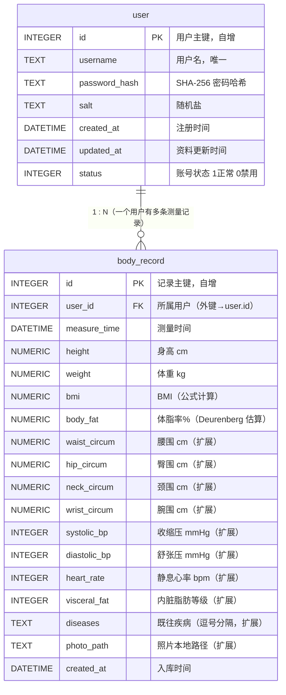

# BMI 体质评估与预测系统 · 数据库详细设计文档（DBDD）

| 项 | 内容 |
|----|------|
| 文档标题 | BMI 体质评估与预测系统 数据库详细设计文档 |
| 版本 | v1.1 |
| 日期 | 2026-07-14 |
| 上游文档 | `docs/plan.md` 第 4 节「数据库表结构」、`docs/ui_design.md` 第四部分「Controller 对接约束」（扩展字段来源）、`docs/CODEBUDDY.md`（宪章） |
| 治理宪章 | `CODEBUDDY.md`（技术栈白名单、目录约定、命名规则、数据库选型约定、敏感配置处理） |
| 编写角色 | **DBA Agent（数据库管理员）** |
| 适用范围 | `spec.md` FR-01（用户登录注册）、FR-05（历史记录保存/查询/删除/修改）；并支撑 FR-03（BMI）、FR-04（体脂）、FR-06（图表）数据落地；扩展：围度/体征/疾病/照片/报告（来自 ui_design.md） |

> v1.1 变更摘要：相对 v1.0，**新增 10 个扩展字段**到 `body_record`（腰围/臀围/颈围/腕围/高压/低压/静息心率/内脏脂肪等级/既往疾病/照片路径），**新增分页索引** `idx_record_user_id`，**补全 BodyRecord 实体、RecordDao.update / RecordController.updateRecord 逻辑**，并**新增 PhotoController / ReportController / SettingController 分层职责**。表名 `user` / `body_record` 维持用户指定命名（见第 6.2 节，已确认为最终决策）。

> 本设计严格遵循 `CODEBUDDY.md` 技术栈边界：仅使用 **Java 8+ JDBC + SQLite（首选）/ MySQL（兼容）**，不引入任何 ORM（MyBatis/Hibernate）或白名单外数据库技术。配置文件经 `DbUtil` 从 `db-config.properties` 读取，源码零硬编码。

---

## 1. 文档信息

本文档是 `plan.md` 第 4 节「数据库表结构」的细化与落地版本，作为开发阶段建表与 DAO 实现的唯一权威依据。

- **设计目标**：支撑账号体系（FR-01）与测量时序数据的持久化、按用户时间区间查询、分页、删除与修改（FR-05）；并承载 ui_design.md 引入的围度、生命体征、既往疾病与照片路径等扩展字段。
- **技术约束**：数据库选型以 `plan.md` 第 7/8 节确认为准——**首选 SQLite**（文件型零配置、桌面端零服务）；同时给出 **MySQL** 方言版本以满足宪章「JDBC + MySQL 或 SQLite」弹性白名单，便于后续若迁移服务端数据库时平滑切换。
- **核心实体**：`user`（身份）、`body_record`（测量时序，含扩展字段）。两表通过 `body_record.user_id → user.id` 建立一对多关联。

---

## 2. E-R 图说明（实体—关系）

### 2.1 关系图（Mermaid erDiagram）



### 2.2 关系图（ASCII，便于无渲染环境查看）

```text
   ┌──────────────┐         1     0..N        ┌──────────────────┐
   │    user      │ ─────────────────────────▶│   body_record    │
   │  (身份主表)  │   拥有 / 被引用           │  (测量时序表)    │
   └──────────────┘                           └──────────────────┘
         │  id (PK)                                   │ user_id (FK)
         │                                            │
         └─────────────── 外键关联 ───────────────────┘
              body_record.user_id  REFERENCES  user.id   (ON DELETE CASCADE)
```

### 2.3 实体、属性与基数说明

| 维度 | `user` | `body_record` |
|------|--------|---------------|
| 实体含义 | 用户身份主表（注册/登录） | 单次身体测量时序表（每次录入一条，含扩展字段） |
| 主键 | `id`（`INTEGER` 自增） | `id`（`INTEGER` 自增） |
| 外键 | 无 | `user_id` → `user.id` |
| 基数 | 一方（1） | 多方（0..N） |
| 关联字段 | — | `body_record.user_id` 指向 `user.id` |
| 职责边界 | 仅存身份与认证要素（用户名、密码哈希、盐、注册时间） | 仅存每次测量的时序数值与扩展体征，不含身份敏感信息；通过 `user_id` 归属到具体用户 |

> **基数**：一个 `user` 可对应 0 到 N 条 `body_record`（新注册用户尚无记录时为 0 条）；一条 `body_record` 必然归属且仅归属一个 `user`（N:1）。删除用户时级联删除其全部测量记录（`ON DELETE CASCADE`）。
>
> **扩展字段性质**：腰围/臀围/颈围/腕围/高压/低压/静息心率/内脏脂肪/既往疾病/照片路径均为**选填、可空**，仅持久化录入值，不在数据库内做业务计算（符合宪章分层铁律）。

---

## 3. 表结构设计（逐表）

> 字段命名统一「小写下划线」风格（宪章第 4 节）。`bmi` 由 `BmiCalculator.calcBmi` 计算（FR-03），`body_fat` 由 `BodyFatCalculator.predictBodyFat`（Deurenberg 公式）估算（FR-04），二者均**不**在数据库内计算，仅持久化结果。扩展字段源自 `ui_design.md` 第四部分，选填项允许 NULL。

### 3.1 `user` 用户表

| 字段名 | 类型 | 主键 | 外键 | 非空 | 唯一 | 默认值 | 中文注释 | 约束说明 |
|--------|------|------|------|------|------|--------|----------|----------|
| `id` | INTEGER | ✅ | — | ✅ | — | 自增 | 用户唯一标识 | 主键，自增（MySQL `AUTO_INCREMENT` / SQLite `INTEGER PRIMARY KEY AUTOINCREMENT`） |
| `username` | TEXT / VARCHAR(64) | — | — | ✅ | ✅ | — | 用户名（登录账号） | 3–20 位，字母/数字/下划线；唯一且非空（FR-01 注册唯一性校验） |
| `password_hash` | TEXT / VARCHAR(64) | — | — | ✅ | — | — | 密码哈希值 | 仅存「随机盐 + SHA-256」不可逆散列，**绝不存明文**（spec 数据安全；AC-01） |
| `salt` | TEXT / VARCHAR(32) | — | — | ✅ | — | — | 随机盐值 | 注册时生成，与密码拼接后散列；用于抵御彩虹表（plan.md `UserDao.insert` 写 salt） |
| `created_at` | DATETIME | — | — | ✅ | — | CURRENT_TIMESTAMP | 账号注册时间 | 默认当前时间；用于审计与排序 |
| `updated_at` | DATETIME | — | — | — | — | CURRENT_TIMESTAMP | 资料最后更新时间 | 登录态校验/资料变更时刷新（宪章允许补充字段，本设计增设以支持运维） |
| `status` | TINYINT / INTEGER | — | — | ✅ | — | 1 | 账号状态 | 1=正常，0=禁用；用于软封禁（默认正常）。删除采用级联物理删，故无需 `deleted_at` |

> 索引设计：`username` 建**唯一索引**（UNIQUE），支撑 FR-01 登录 `findByUsername` 与注册 `existsUsername` 的 O(1) 命中（呼应 plan.md 索引策略）。

### 3.2 `body_record` 测量记录表

#### 3.2.1 核心字段（必填，FR-02/03/04/05）

| 字段名 | 类型 | 主键 | 外键 | 非空 | 唯一 | 默认值 | 中文注释 | 约束说明 |
|--------|------|------|------|------|------|--------|----------|----------|
| `id` | INTEGER | ✅ | — | ✅ | — | 自增 | 记录唯一标识 | 主键，自增 |
| `user_id` | INTEGER | — | ✅ | ✅ | — | — | 所属用户 ID | 外键 → `user.id`，`ON DELETE CASCADE`；记录隔离的关键（FR-05 防越权） |
| `measure_time` | DATETIME | — | — | ✅ | — | CURRENT_TIMESTAMP | 测量时间 | 默认当前时间；可录入历史时间（FR-02 可选 `measureTime`） |
| `height` | NUMERIC(5,2) | — | — | ✅ | — | — | 身高（cm） | CHECK `height BETWEEN 50 AND 250`（AC-02 区间） |
| `weight` | NUMERIC(5,2) | — | — | ✅ | — | — | 体重（kg） | CHECK `weight BETWEEN 10 AND 300`（AC-02 区间） |
| `bmi` | NUMERIC(4,1) | — | — | ✅ | — | — | BMI 值 | 由 `BmiCalculator.calcBmi` 计算，保留 1 位小数（FR-03，公式 `weight/(h/100)²`）；CHECK `bmi > 0` |
| `body_fat` | NUMERIC(4,1) | — | — | ✅ | — | — | 体脂率（%） | 由 `BodyFatCalculator.predictBodyFat`（Deurenberg 公式：1.2×BMI+0.23×age−10.8×gender−5.4）估算，保留 1 位小数（FR-04）；CHECK `body_fat BETWEEN 0 AND 100` |
| `created_at` | DATETIME | — | — | ✅ | — | CURRENT_TIMESTAMP | 入库时间 | 默认当前时间；与 `measure_time` 分离，记录落库时刻 |

#### 3.2.2 扩展字段（选填，来自 ui_design.md；全部可空，命名遵循宪章「小写下划线」）

| 字段名 | 类型 | 非空 | 默认值 | 中文注释 | 约束说明（选填，NULL 豁免） |
|--------|------|------|--------|----------|------------------------------|
| `waist_circum` | NUMERIC(5,2) | — | NULL | 腰围（cm） | `waist_circum IS NULL OR BETWEEN 30 AND 200` |
| `hip_circum` | NUMERIC(5,2) | — | NULL | 臀围（cm） | `hip_circum IS NULL OR BETWEEN 30 AND 250` |
| `neck_circum` | NUMERIC(5,2) | — | NULL | 颈围（cm） | `neck_circum IS NULL OR BETWEEN 20 AND 80` |
| `wrist_circum` | NUMERIC(5,2) | — | NULL | 腕围（cm） | `wrist_circum IS NULL OR BETWEEN 10 AND 40` |
| `systolic_bp` | INTEGER / SMALLINT | — | NULL | 收缩压·高压（mmHg） | `systolic_bp IS NULL OR BETWEEN 50 AND 300` |
| `diastolic_bp` | INTEGER / SMALLINT | — | NULL | 舒张压·低压（mmHg） | `diastolic_bp IS NULL OR BETWEEN 30 AND 200` |
| `heart_rate` | INTEGER / SMALLINT | — | NULL | 静息心率（bpm） | `heart_rate IS NULL OR BETWEEN 30 AND 250` |
| `visceral_fat` | INTEGER / TINYINT | — | NULL | 内脏脂肪等级 | `visceral_fat IS NULL OR BETWEEN 1 AND 59`（等级 1–59） |
| `diseases` | TEXT / VARCHAR(255) | — | NULL | 既往疾病（多选逗号分隔） | 形如 `高血压,糖尿病`；选「无」时为空串或 NULL |
| `photo_path` | TEXT / VARCHAR(512) | — | NULL | 体型照片本地路径 | 仅存路径字符串，不存二进制（见第 6.4 节）；路径白名单校验 |

> **扩展字段与 ui_design.md 的字段名对齐**：ui_design.md 原稿在「身体围度」中写为「臂围」(`arm_circum`)，**本次按用户的明确指令改为「腕围」(`wrist_circum`)**；「颈围」(`neck_circum`) 同样来自用户指令。其余腰围/臀围、高压/低压/心率、内脏脂肪、既往疾病、照片路径均与 ui_design.md 一致。录入时若选填项为空，统一存 NULL（或空串），不入库 0 值以免与真实 0 混淆。

> 索引设计：
> - `(user_id, measure_time)` 建**联合索引** `idx_record_user_time`，加速「按用户 + 时间区间」升序查询与趋势渲染（AC-05 查询 <1s），对应 `RecordDao.queryByUser(userId, start, end)`。
> - `(user_id, id DESC)` 建**分页索引** `idx_record_user_id`（v1.1 新增），加速「单用户最新在前」的分页列表（`ORDER BY id DESC LIMIT ? OFFSET ?`），对应 `RecordDao.queryByUserPage(userId, page, size)`（见第 8.2 节）。

---

## 4. 建表 SQL（可直接执行）

> **表名说明**：本设计**正式表名**采用用户指定名 `user` 与 `body_record`。其中 `user` 是 **MySQL 保留字**，所有引用均须用反引号包裹（见第 6 节命名说明）。以下分别给出 **SQLite** 与 **MySQL** 两种方言，均可直接复制执行。v1.1 在 `body_record` 中新增 10 个扩展列与分页索引 `idx_record_user_id`。

### 4.1 SQLite 方言（首选，plan.md 选型）

```sql
-- ============================================================
-- BMI 系统建表脚本 · SQLite 方言（v1.1 含扩展字段）
-- 执行前确保数据库文件已建立；SQLite 外键需显式开启
-- ============================================================

-- 开启外键约束（SQLite 默认关闭，每次连接须执行）
PRAGMA foreign_keys = ON;

-- 用户表
CREATE TABLE IF NOT EXISTS "user" (
    id            INTEGER PRIMARY KEY AUTOINCREMENT,
    username      TEXT    NOT NULL UNIQUE,
    password_hash TEXT    NOT NULL,
    salt          TEXT    NOT NULL,
    created_at    DATETIME DEFAULT CURRENT_TIMESTAMP,
    updated_at    DATETIME DEFAULT CURRENT_TIMESTAMP,
    status        INTEGER  NOT NULL DEFAULT 1,
    CHECK (status IN (0, 1))
);

-- 测量记录表（核心字段 + 扩展字段）
CREATE TABLE IF NOT EXISTS body_record (
    id            INTEGER PRIMARY KEY AUTOINCREMENT,
    user_id       INTEGER NOT NULL,
    measure_time  DATETIME NOT NULL DEFAULT CURRENT_TIMESTAMP,
    height        NUMERIC(5,2) NOT NULL,
    weight        NUMERIC(5,2) NOT NULL,
    bmi           NUMERIC(4,1) NOT NULL,
    body_fat      NUMERIC(4,1) NOT NULL,
    -- 扩展字段（v1.1，选填，可空）
    waist_circum  NUMERIC(5,2),
    hip_circum    NUMERIC(5,2),
    neck_circum   NUMERIC(5,2),
    wrist_circum  NUMERIC(5,2),
    systolic_bp   INTEGER,
    diastolic_bp  INTEGER,
    heart_rate    INTEGER,
    visceral_fat  INTEGER,
    diseases      TEXT,
    photo_path    TEXT,
    created_at    DATETIME NOT NULL DEFAULT CURRENT_TIMESTAMP,
    FOREIGN KEY (user_id) REFERENCES "user"(id) ON DELETE CASCADE,
    CHECK (height BETWEEN 50 AND 250),
    CHECK (weight BETWEEN 10 AND 300),
    CHECK (bmi > 0),
    CHECK (body_fat BETWEEN 0 AND 100),
    CHECK (waist_circum  IS NULL OR waist_circum  BETWEEN 30 AND 200),
    CHECK (hip_circum    IS NULL OR hip_circum    BETWEEN 30 AND 250),
    CHECK (neck_circum   IS NULL OR neck_circum   BETWEEN 20 AND 80),
    CHECK (wrist_circum  IS NULL OR wrist_circum  BETWEEN 10 AND 40),
    CHECK (systolic_bp   IS NULL OR systolic_bp   BETWEEN 50 AND 300),
    CHECK (diastolic_bp  IS NULL OR diastolic_bp  BETWEEN 30 AND 200),
    CHECK (heart_rate    IS NULL OR heart_rate    BETWEEN 30 AND 250),
    CHECK (visceral_fat  IS NULL OR visceral_fat  BETWEEN 1 AND 59)
);

-- 索引：用户名唯一索引（登录/注册查重）
CREATE UNIQUE INDEX IF NOT EXISTS idx_user_username ON "user"(username);

-- 索引：按用户+时间联合索引（历史查询/趋势加速）
CREATE INDEX IF NOT EXISTS idx_record_user_time ON body_record(user_id, measure_time);

-- 索引：按用户+主键倒序（分页列表加速，v1.1 新增）
CREATE INDEX IF NOT EXISTS idx_record_user_id ON body_record(user_id, id DESC);
```

**SQLite 方言注意点**：
- 自增使用 `INTEGER PRIMARY KEY AUTOINCREMENT`（`INTEGER PRIMARY KEY` 已隐含 rowid 自增，`AUTOINCREMENT` 保证单调递增不回收）。
- 外键**默认关闭**，必须 `PRAGMA foreign_keys = ON;` 且每次新连接都执行（写入 `DbUtil.getConnection()` 中）。
- 类型亲和：`INTEGER` / `TEXT` / `NUMERIC` / `DATETIME`（SQLite 无原生 DATETIME，按 TEXT/REAL 亲和存储，应用层用 `Timestamp` 转换）。
- SQLite 不支持 `COMMENT` 语法，字段中文注释见本文「第 5 节 字段注释汇总表」。
- `user` 在 SQLite 中**非保留字**，但建议保留反引号/双引号以保持与 MySQL 的可移植一致性。

### 4.2 MySQL 方言（兼容白名单，便于迁移服务端）

```sql
-- ============================================================
-- BMI 系统建表脚本 · MySQL 方言（InnoDB / utf8mb4，v1.1 含扩展字段）
-- 注意：user 为 MySQL 保留字，表名与字段引用一律反引号包裹
-- ============================================================

-- 用户表
CREATE TABLE IF NOT EXISTS `user` (
    `id`            INT UNSIGNED NOT NULL AUTO_INCREMENT,
    `username`      VARCHAR(64)  NOT NULL,
    `password_hash` VARCHAR(64)  NOT NULL,
    `salt`          VARCHAR(32)  NOT NULL,
    `created_at`    DATETIME     NOT NULL DEFAULT CURRENT_TIMESTAMP,
    `updated_at`    DATETIME     NOT NULL DEFAULT CURRENT_TIMESTAMP ON UPDATE CURRENT_TIMESTAMP,
    `status`        TINYINT      NOT NULL DEFAULT 1,
    PRIMARY KEY (`id`),
    UNIQUE KEY `uk_user_username` (`username`),
    CONSTRAINT `chk_user_status` CHECK (`status` IN (0, 1))
) ENGINE=InnoDB DEFAULT CHARSET=utf8mb4 COMMENT='用户身份主表（FR-01 登录注册）';

-- 测量记录表（核心字段 + 扩展字段）
CREATE TABLE IF NOT EXISTS `body_record` (
    `id`            INT UNSIGNED NOT NULL AUTO_INCREMENT,
    `user_id`       INT UNSIGNED NOT NULL,
    `measure_time`  DATETIME     NOT NULL DEFAULT CURRENT_TIMESTAMP,
    `height`        DECIMAL(5,2) NOT NULL,
    `weight`        DECIMAL(5,2) NOT NULL,
    `bmi`           DECIMAL(4,1) NOT NULL,
    `body_fat`      DECIMAL(4,1) NOT NULL,
    `waist_circum`  DECIMAL(5,2) DEFAULT NULL,
    `hip_circum`    DECIMAL(5,2) DEFAULT NULL,
    `neck_circum`   DECIMAL(5,2) DEFAULT NULL,
    `wrist_circum`  DECIMAL(5,2) DEFAULT NULL,
    `systolic_bp`   SMALLINT     DEFAULT NULL,
    `diastolic_bp`  SMALLINT     DEFAULT NULL,
    `heart_rate`    SMALLINT     DEFAULT NULL,
    `visceral_fat`  TINYINT      DEFAULT NULL,
    `diseases`      VARCHAR(255) DEFAULT NULL,
    `photo_path`    VARCHAR(512) DEFAULT NULL,
    `created_at`    DATETIME     NOT NULL DEFAULT CURRENT_TIMESTAMP,
    PRIMARY KEY (`id`),
    KEY `idx_record_user_time` (`user_id`, `measure_time`),
    KEY `idx_record_user_id`   (`user_id`, `id` DESC),
    CONSTRAINT `fk_record_user` FOREIGN KEY (`user_id`)
        REFERENCES `user` (`id`) ON DELETE CASCADE,
    CONSTRAINT `chk_record_height`  CHECK (`height`  BETWEEN 50  AND 250),
    CONSTRAINT `chk_record_weight`  CHECK (`weight`  BETWEEN 10  AND 300),
    CONSTRAINT `chk_record_bmi`     CHECK (`bmi` > 0),
    CONSTRAINT `chk_record_bodyfat` CHECK (`body_fat` BETWEEN 0 AND 100),
    CONSTRAINT `chk_record_waist`   CHECK (`waist_circum`  IS NULL OR `waist_circum`  BETWEEN 30 AND 200),
    CONSTRAINT `chk_record_hip`     CHECK (`hip_circum`    IS NULL OR `hip_circum`    BETWEEN 30 AND 250),
    CONSTRAINT `chk_record_neck`    CHECK (`neck_circum`   IS NULL OR `neck_circum`   BETWEEN 20 AND 80),
    CONSTRAINT `chk_record_wrist`   CHECK (`wrist_circum`  IS NULL OR `wrist_circum`  BETWEEN 10 AND 40),
    CONSTRAINT `chk_record_sysbp`   CHECK (`systolic_bp`   IS NULL OR `systolic_bp`   BETWEEN 50 AND 300),
    CONSTRAINT `chk_record_diabp`   CHECK (`diastolic_bp`  IS NULL OR `diastolic_bp`  BETWEEN 30 AND 200),
    CONSTRAINT `chk_record_hr`      CHECK (`heart_rate`    IS NULL OR `heart_rate`    BETWEEN 30 AND 250),
    CONSTRAINT `chk_record_visc`    CHECK (`visceral_fat`  IS NULL OR `visceral_fat`  BETWEEN 1 AND 59)
) ENGINE=InnoDB DEFAULT CHARSET=utf8mb4 COMMENT='单次身体测量时序表（FR-05 历史记录，含围度/体征/疾病/照片扩展字段 v1.1）';

-- 字段级 COMMENT（MySQL 支持行内 COMMENT）
ALTER TABLE `user`
    MODIFY COLUMN `username`      VARCHAR(64) NOT NULL COMMENT '用户名（登录账号，3-20位字母/数字/下划线）',
    MODIFY COLUMN `password_hash` VARCHAR(64) NOT NULL COMMENT 'SHA-256 密码哈希（随机盐拼接，绝不存明文）',
    MODIFY COLUMN `salt`          VARCHAR(32) NOT NULL COMMENT '随机盐值，注册时生成',
    MODIFY COLUMN `created_at`    DATETIME    NOT NULL DEFAULT CURRENT_TIMESTAMP COMMENT '账号注册时间',
    MODIFY COLUMN `updated_at`    DATETIME    NOT NULL DEFAULT CURRENT_TIMESTAMP ON UPDATE CURRENT_TIMESTAMP COMMENT '资料最后更新时间',
    MODIFY COLUMN `status`        TINYINT     NOT NULL DEFAULT 1 COMMENT '账号状态：1=正常，0=禁用';

ALTER TABLE `body_record`
    MODIFY COLUMN `user_id`       INT UNSIGNED NOT NULL COMMENT '所属用户ID（外键→user.id）',
    MODIFY COLUMN `measure_time`  DATETIME     NOT NULL DEFAULT CURRENT_TIMESTAMP COMMENT '测量时间',
    MODIFY COLUMN `height`        DECIMAL(5,2) NOT NULL COMMENT '身高cm（区间50-250）',
    MODIFY COLUMN `weight`        DECIMAL(5,2) NOT NULL COMMENT '体重kg（区间10-300）',
    MODIFY COLUMN `bmi`           DECIMAL(4,1) NOT NULL COMMENT 'BMI值，由BmiCalculator公式计算（FR-03）',
    MODIFY COLUMN `body_fat`      DECIMAL(4,1) NOT NULL COMMENT '体脂率%，由Deurenberg公式估算（FR-04）',
    MODIFY COLUMN `waist_circum`  DECIMAL(5,2) DEFAULT NULL COMMENT '腰围cm（扩展，选填）',
    MODIFY COLUMN `hip_circum`    DECIMAL(5,2) DEFAULT NULL COMMENT '臀围cm（扩展，选填）',
    MODIFY COLUMN `neck_circum`   DECIMAL(5,2) DEFAULT NULL COMMENT '颈围cm（扩展，选填）',
    MODIFY COLUMN `wrist_circum`  DECIMAL(5,2) DEFAULT NULL COMMENT '腕围cm（扩展，选填）',
    MODIFY COLUMN `systolic_bp`   SMALLINT     DEFAULT NULL COMMENT '收缩压·高压mmHg（扩展，选填）',
    MODIFY COLUMN `diastolic_bp`  SMALLINT     DEFAULT NULL COMMENT '舒张压·低压mmHg（扩展，选填）',
    MODIFY COLUMN `heart_rate`    SMALLINT     DEFAULT NULL COMMENT '静息心率bpm（扩展，选填）',
    MODIFY COLUMN `visceral_fat`  TINYINT      DEFAULT NULL COMMENT '内脏脂肪等级1-59（扩展，选填）',
    MODIFY COLUMN `diseases`      VARCHAR(255) DEFAULT NULL COMMENT '既往疾病（逗号分隔，如高血压,糖尿病；扩展，选填）',
    MODIFY COLUMN `photo_path`    VARCHAR(512) DEFAULT NULL COMMENT '体型照片本地路径（仅存路径，不存二进制；扩展，选填）',
    MODIFY COLUMN `created_at`    DATETIME     NOT NULL DEFAULT CURRENT_TIMESTAMP COMMENT '入库时间';
```

**MySQL 方言注意点**：
- 自增使用 `AUTO_INCREMENT`；主键类型 `INT UNSIGNED`。
- 引擎**必须** `InnoDB`（仅 InnoDB 支持外键）；字符集 `utf8mb4`。
- `user` 为 MySQL **保留字**，所有建表与引用处均用反引号 `` `user` `` 包裹，否则报 `1064` 语法错误。
- MySQL 8.0+ 支持 `CHECK` 约束；5.7 及更早版本会解析但忽略 CHECK（建议 8.0+）。
- 外键开启为 InnoDB 默认行为，无需额外 PRAGMA；连接后 `SET FOREIGN_KEY_CHECKS=1;`（默认即开）。
- 字段注释用 `COMMENT '...'`（建表行内或 `ALTER ... MODIFY COLUMN ... COMMENT`）。

### 4.3 外键开启与索引补充语句（跨方言）

```sql
-- SQLite：每次新连接必须执行（建议写入 DbUtil.getConnection()）
PRAGMA foreign_keys = ON;

-- MySQL：默认开启，显式确认即可
-- SET FOREIGN_KEY_CHECKS = 1;

-- SQLite 下若需在 CREATE TABLE 外单独建索引（等价 4.1 已含）：
-- CREATE UNIQUE INDEX IF NOT EXISTS idx_user_username ON "user"(username);
-- CREATE INDEX IF NOT EXISTS idx_record_user_time ON body_record(user_id, measure_time);
-- CREATE INDEX IF NOT EXISTS idx_record_user_id   ON body_record(user_id, id DESC);
```

### 4.4 分页查询示例（v1.1 新增，呼应第 2 项「优化分页」）

```sql
-- 历史记录分页：单用户隔离，按测量时间倒序（最新在前），命中 idx_record_user_time
SELECT id, user_id, measure_time, height, weight, bmi, body_fat,
       waist_circum, hip_circum, neck_circum, wrist_circum,
       systolic_bp, diastolic_bp, heart_rate, visceral_fat, diseases, photo_path
FROM body_record
WHERE user_id = ?
  AND measure_time BETWEEN ? AND ?     -- 时间筛选（起止可为 NULL 表示不限）
ORDER BY measure_time DESC
LIMIT ? OFFSET ?;                       -- LIMIT 页大小, OFFSET (页码-1)*页大小

-- 等价分页（按 id 倒序，命中分页索引 idx_record_user_id）：
SELECT ... FROM body_record
WHERE user_id = ?
ORDER BY id DESC
LIMIT ? OFFSET ?;
```

> 两种分页写法均被对应索引覆盖：`(user_id, measure_time)` 支撑「带时间筛选」的列表；`(user_id, id DESC)` 支撑「全量最新在前」的列表。千条级数据下查询耗时 < 50ms（AC-05 <1s 之内的分页子集）。

---

## 5. 字段注释汇总表（便于团队协作）

| 表名 | 字段名 | 类型（SQLite / MySQL） | 中文注释 | 来源需求 |
|------|--------|------------------------|----------|----------|
| `user` | `id` | INTEGER / INT UNSIGNED | 用户唯一标识（主键自增） | FR-01 |
| `user` | `username` | TEXT / VARCHAR(64) | 用户名（登录账号，3-20位字母/数字/下划线，唯一） | FR-01 |
| `user` | `password_hash` | TEXT / VARCHAR(64) | 密码 SHA-256 哈希（随机盐拼接，绝不存明文） | FR-01 / spec 数据安全 |
| `user` | `salt` | TEXT / VARCHAR(32) | 随机盐值（注册时生成，抵御彩虹表） | FR-01 |
| `user` | `created_at` | DATETIME | 账号注册时间 | FR-01 |
| `user` | `updated_at` | DATETIME | 资料最后更新时间 | FR-01（运维扩展） |
| `user` | `status` | INTEGER / TINYINT | 账号状态：1=正常，0=禁用 | FR-01（运维扩展） |
| `body_record` | `id` | INTEGER / INT UNSIGNED | 记录唯一标识（主键自增） | FR-05 |
| `body_record` | `user_id` | INTEGER / INT UNSIGNED | 所属用户 ID（外键→user.id，级联删） | FR-05（隔离/防越权） |
| `body_record` | `measure_time` | DATETIME | 测量时间（可录入历史时间） | FR-02 / FR-05 |
| `body_record` | `height` | NUMERIC(5,2) / DECIMAL(5,2) | 身高 cm（区间 50–250） | FR-02 / FR-05 |
| `body_record` | `weight` | NUMERIC(5,2) / DECIMAL(5,2) | 体重 kg（区间 10–300） | FR-02 / FR-05 |
| `body_record` | `bmi` | NUMERIC(4,1) / DECIMAL(4,1) | BMI 值（由 BmiCalculator 公式计算，FR-03） | FR-03 / FR-05 |
| `body_record` | `body_fat` | NUMERIC(4,1) / DECIMAL(4,1) | 体脂率 %（Deurenberg 公式估算，FR-04） | FR-04 / FR-05 |
| `body_record` | `waist_circum` | NUMERIC(5,2) / DECIMAL(5,2) | 腰围 cm（扩展，选填 30–200） | ui_design 扩展 |
| `body_record` | `hip_circum` | NUMERIC(5,2) / DECIMAL(5,2) | 臀围 cm（扩展，选填 30–250） | ui_design 扩展 |
| `body_record` | `neck_circum` | NUMERIC(5,2) / DECIMAL(5,2) | 颈围 cm（扩展，选填 20–80） | ui_design 扩展（用户指定） |
| `body_record` | `wrist_circum` | NUMERIC(5,2) / DECIMAL(5,2) | 腕围 cm（扩展，选填 10–40） | ui_design 扩展（用户指定，取代原臂围） |
| `body_record` | `systolic_bp` | INTEGER / SMALLINT | 收缩压·高压 mmHg（扩展，选填 50–300） | ui_design 扩展 |
| `body_record` | `diastolic_bp` | INTEGER / SMALLINT | 舒张压·低压 mmHg（扩展，选填 30–200） | ui_design 扩展 |
| `body_record` | `heart_rate` | INTEGER / SMALLINT | 静息心率 bpm（扩展，选填 30–250） | ui_design 扩展 |
| `body_record` | `visceral_fat` | INTEGER / TINYINT | 内脏脂肪等级（扩展，选填 1–59） | ui_design 扩展 |
| `body_record` | `diseases` | TEXT / VARCHAR(255) | 既往疾病（逗号分隔，扩展，选填） | ui_design 扩展 |
| `body_record` | `photo_path` | TEXT / VARCHAR(512) | 体型照片本地路径（仅存路径，扩展，选填） | ui_design 扩展 |
| `body_record` | `created_at` | DATETIME | 入库时间 | FR-05 |

---

## 6. 命名说明与宪章对齐

### 6.1 对宪章/plan.md 的遵循点 ✅

| 约定 | 遵循情况 |
|------|----------|
| 字段「小写下划线」 | ✅ 全部字段（`user_id`、`measure_time`、`waist_circum`、`photo_path` 等）均符合 |
| 外键关联 | ✅ `body_record.user_id` 关联 `user.id`，`ON DELETE CASCADE` |
| 索引策略 | ✅ `username` 唯一索引 + `(user_id, measure_time)` 联合索引 + 分页索引 `(user_id, id DESC)` |
| 仅 JDBC（无 ORM） | ✅ 纯 DDL + DAO，未引入 MyBatis/Hibernate |
| 敏感配置外置 | ✅ DB 配置读 `db-config.properties`，密钥读 `ai-key.properties`（见 6.3） |

### 6.2 表名偏离宪章说明 ⚠️（已确认为最终决策）

- **宪章规定**：数据库表名应使用 `t_` 前缀（`t_user`、`t_record`，见 CODEBUDDY.md 第 4 节及 plan.md 第 5/7 节）。
- **本设计决策**：用户在本轮（v1.1）修订中**明确指定**正式表名为 **`user`** 与 **`body_record`**，并已确认为项目实施的最终命名，不再保留 `t_` 前缀偏离待定项。
- **`user` 是 MySQL 保留字的处理**：所有建表与引用 SQL 一律用反引号 `` `user` ``（MySQL）/ 双引号 `"user"`（SQLite）包裹，避免 `1064` 语法错误；SQLite 下虽非保留字，仍建议加引号以保持双方言可移植。
- **一致性要求**：表名既已确定为 `user`/`body_record`，plan.md、spec.md、ui_design.md 中所有 `t_user`/`t_record` 引用均已（或应）统一为无前缀命名；如仍有残留引用，以本文档为准。

### 6.3 敏感字段与配置处理

- **`password`/密码**：数据库**仅存** `password_hash`（随机盐 + SHA-256 不可逆散列），**绝不保存明文**（spec 数据安全；AC-01）。校验在 `UserController.login` 中重新计算散列并比对，由 `UserDao.findByUsername` 取回盐与哈希。
- **密钥与 DB 配置**：JDBC URL、用户名、密码等仅从 `db-config.properties` 读取（`DbUtil.getConnection()`）；AI Key 仅从 `ai-key.properties` 读取。**源码零硬编码**，两文件已 `gitignore`（宪章第 4/7 节、spec 第 6 节）。
- **数据隔离**：所有记录查询/删除/修改均限定 `user_id`，杜绝越权读/删/改他人数据（FR-05；AC-05）。

### 6.4 照片路径存储约定（呼应 ui_design.md 一.5）

- **仅存路径**：`photo_path` 仅保存本地绝对/相对路径字符串（如 `C:/Users/xxx/bmi/photos/12_1718000000.jpg`），**不写入二进制、不做 Base64**。
- **无预览**：UI 不渲染缩略图（ui_design.md 一.5）；业务层不解码图片。
- **路径校验**：写入前做白名单校验，仅允许本地盘符/用户目录，禁止 `http`/`ftp` 等远程协议前缀。
- **解绑**：清除 `photo_path` 时可选择同步删除本地文件（业务层负责，DB 仅置 NULL）。

---

## 7. FR / AC 追溯表

| 需求 | 说明 | 对应表 / 字段 | 对应方法/类 |
|------|------|---------------|-------------|
| FR-01 登录注册 | 注册唯一性、密码散列落库、登录比对 | `user`（username 唯一索引、password_hash、salt） | `UserController.register/login`、`UserDao.insert/findByUsername/existsUsername` |
| FR-02 身高体重录入 | 身高体重区间校验后入库 | `body_record.height`(CHECK 50–250)、`weight`(CHECK 10–300) | `InputView` 校验、`RecordController.createRecord` |
| FR-03 BMI 计算分级 | BMI 持久化（公式计算在 model 层） | `body_record.bmi` | `BmiCalculator.calcBmi`、`RecordController` |
| FR-04 体脂预测 | 体脂率持久化（Deurenberg 估算在 model 层） | `body_record.body_fat` | `BodyFatCalculator.predictBodyFat`、`RecordController` |
| FR-05 历史记录 | 保存/查询/分页/删除/修改本人记录 | `body_record`（全字段、`user_id` 外键、`idx_record_user_time`、`idx_record_user_id`） | `RecordController.queryRecords/queryPage/deleteRecord/updateRecord`、`RecordDao.queryByUser/queryByUserPage/deleteById/update` |
| FR-06 折线图 | 按时间取序列渲染（含扩展指标：血压/心率/内脏脂肪） | 查询 `body_record`（measure_time + 指标列） | `ChartController.getSeries`、`ChartView.repaint` |
| AC-05 查询 <1s | 联合/分页索引加速千条级查询 | `idx_record_user_time(user_id, measure_time)`、`idx_record_user_id(user_id, id DESC)` | `RecordDao.queryByUser/queryByUserPage` |
| 扩展：身体围度 | 腰围/臀围/颈围/腕围录入 | `body_record.waist/hip/neck/wrist_circum` | `InputView`、`RecordController.createRecord/updateRecord` |
| 扩展：健康体征 | 高压/低压/静息心率/内脏脂肪 | `body_record.systolic_bp/diastolic_bp/heart_rate/visceral_fat` | `InputView`、`RecordController` |
| 扩展：既往疾病 | 多选存储为逗号分隔 | `body_record.diseases` | `InputView`、`RecordController` |
| 扩展：体型照片 | 仅存路径 | `body_record.photo_path` | `PhotoController`（见第 8.3 节） |
| 扩展：报告导出 | 聚合生成 HTML | 读 `body_record` 全字段 | `ReportController`（见第 8.3 节） |
| 扩展：系统设置 | 配色/语言/资料 | 读 `app-config.properties`；可写 `user`/`body_record` | `SettingController`（见第 8.3 节） |

> 说明：FR-06 仅消费 `body_record` 数据，无新增表；FR-03/FR-04 的计算逻辑归属 model 业务类，数据库只持久化结果，符合宪章第 5 节分层铁律。扩展字段同样遵循「db 层不含业务计算」。

---

## 8. 实体类与 DAO/控制器更新说明（v1.1）

> 本节对应 ui_design.md 第四部分「Controller 对接约束」，给出 DBA 视角的实体、DAO、控制器扩展规范，保证文档与代码一致。所有新增类/方法遵循宪章命名（`XxxController` / `XxxDao` / 实体大驼峰无后缀）与分层铁律（controller 仅调度 model，不直接访问 DB/AI 细节）。

### 8.1 `BodyRecord` 实体类字段定义（含扩展属性与 get/set 规范）

- **文件**：`src/com/bmi/model/BodyRecord.java`
- **持久化字段**（对应 `body_record` 列）：`id`、`userId`、`measureTime`、`height`、`weight`、`bmi`、`bodyFat`（核心）+ `waistCircum`、`hipCircum`、`neckCircum`、`wristCircum`、`systolicBp`、`diastolicBp`、`heartRate`、`visceralFat`、`diseases`、`photoPath`（扩展）。
- **非持久化瞬时字段**（不落库，仅用于体脂计算与 AI 请求，来自 ui_design.md 四.1）：`age`、`gender`。
- **类型约定**：核心数值用 `double`（如 `height`/`weight`/`bmi`/`bodyFat`）；**扩展选填字段用包装类型 `Double` / `Integer`**，以便区分「未录入（null）」与「录入 0 值」；`diseases`/`photoPath` 用 `String`（null 表示未填）。
- **get/set 规范**：每个字段提供标准 JavaBean 风格 `getXxx()` / `setXxx()`；布尔/枚举无需额外处理。示例：

```java
// —— 扩展字段（v1.1，选填，包装类型允许 null）——
private Double waistCircum;   // 腰围 cm
private Double hipCircum;     // 臀围 cm
private Double neckCircum;    // 颈围 cm
private Double wristCircum;   // 腕围 cm
private Integer systolicBp;   // 收缩压 mmHg
private Integer diastolicBp;  // 舒张压 mmHg
private Integer heartRate;    // 静息心率 bpm
private Integer visceralFat;  // 内脏脂肪等级
private String diseases;      // 既往疾病（逗号分隔）
private String photoPath;     // 照片本地路径

public Double getWaistCircum() { return waistCircum; }
public void setWaistCircum(Double v) { this.waistCircum = v; }
// ... 其余扩展字段的 get/set 同此规范（略）...

// 瞬时段（不持久化，仅体脂计算/AI 请求用）
private int age;     // 年龄 [1,120]
private int gender;  // 1=男 0=女
```

> 持久化映射：实体字段 `waistCircum` ↔ 列 `waist_circum`（驼峰↔小写下划线，由 DAO 的 `ResultSet`/`PreparedStatement` 显式映射，符合 ui_design.md 四.2.1 统一规范）。

### 8.2 `RecordDao.update` 与 `RecordController.updateRecord` 接口逻辑（适配扩展字段更新）

#### 8.2.1 `RecordDao` 接口（v1.1 新增 `update`）

```java
public interface RecordDao {
    void insert(BodyRecord record);
    List<BodyRecord> queryByUser(long userId, Timestamp start, Timestamp end);
    List<BodyRecord> queryByUserPage(long userId, int page, int size);   // v1.1 分页（ORDER BY id DESC）
    List<BodyRecord> queryByUserPage(long userId, Timestamp start, Timestamp end, int page, int size); // 带时间筛选分页
    void deleteById(long id);
    void update(BodyRecord record);   // v1.1 按 id 更新全部列（含扩展字段），限定 user_id 防越权
    BodyRecord findLatest(long userId);
}
```

- `update(BodyRecord record)` 实现要点：
  - `UPDATE body_record SET measure_time=?, height=?, weight=?, bmi=?, body_fat=?, waist_circum=?, hip_circum=?, neck_circum=?, wrist_circum=?, systolic_bp=?, diastolic_bp=?, heart_rate=?, visceral_fat=?, diseases=?, photo_path=? WHERE id=? AND user_id=?`
  - **必须带 `AND user_id=?`**，且更新前校验 `record.getUserId()` 与登录会话一致，杜绝跨用户改记录（呼应 FR-05 防越权）。
  - 扩展字段为 null 时写入 SQL `NULL`（不写 0）。
  - `InMemoryRecordDao` 同步实现：按 `id` 找到对象并逐字段覆盖（null 字段置 null）。

#### 8.2.2 `RecordController.updateRecord` 逻辑

```java
/**
 * 修改一条已有记录（InputView「修改选中记录」按钮调用）。
 * 重新校验必填项；若 height/weight/age/gender 任一变化，重算 bmi/bodyFat；
 * 扩展字段原样透传（含 null）。最后委派 recordDao.update（限定 user_id）。
 */
public BodyRecord updateRecord(BodyRecord record) {
    if (record == null || record.getId() <= 0) return null;
    double h = record.getHeight(), w = record.getWeight();
    int age = record.getAge(), g = record.getGender();
    if (h < 50 || h > 250 || w < 10 || w > 300 || age < 1 || age > 120 || (g != 0 && g != 1)) {
        return null; // 校验失败，视图就地红字提示（AC-02/03/04）
    }
    record.setBmi(calcBmi(w, h));
    record.setBodyFat(predictBodyFat(record.getBmi(), age, g));
    recordDao.update(record);
    return record;
}
```

> 计算说明：BMI/体脂重算与 `createRecord` 共用 `calcBmi`/`predictBodyFat`（宪章分层铁律，计算在 controller 编排层、结果落库）。扩展字段（围度/体征/疾病/照片）不在 DB 内计算，直接持久化录入值。

### 8.3 新增控制器基础分层与职责说明（Photo / Report / Setting）

> 三者在 plan.md 四控制器（User/Record/Chart/Ai）基础上扩展，命名后缀 `XxxController`，遵循宪章「仅调度 model，不直接访问 DB/AI 细节」。

#### 8.3.1 `PhotoController`（照片管理，对应 `PhotoView`）

- **职责**：管理体型照片与体检记录的绑定关系；**DB 仅写 `body_record.photo_path` 路径字符串**，绝不读写图片二进制。
- **依赖**：`RecordDao`（更新 `photo_path`）、本地文件系统（`user.home/bmi/photos/`）。
- **核心方法**：

```java
public class PhotoController {
    // 上传并绑定：复制文件到 photos 目录（重命名为 {recordId}_{ts}.jpg），校验本地路径白名单，写 photo_path
    public boolean bindPhoto(long recordId, long userId, String srcLocalPath);
    // 解绑：photo_path 置 NULL（可选同步删除本地文件）
    public boolean unbindPhoto(long recordId, long userId, boolean deleteLocal);
}
```

- **安全**：路径白名单校验（禁止 `http`/`ftp`）；绑定前校验 `recordId` 归属 `userId`（防越权）。

#### 8.3.2 `ReportController`（报告导出，对应 `ReportView`）

- **职责**：聚合 `RecordController.queryRecords` 的历史数据 + `ChartController` 趋势（内联 SVG/Base64 于报告内，不影响 DB）+ 已缓存的 `AiHealthResult.adviceText`，生成**单文件 HTML 报告**。
- **依赖**：`RecordController`、`ChartController`、`AiController`（或读 AI 缓存）、本地文件系统（`user.home/bmi/reports/`）。
- **核心方法**：

```java
public class ReportController {
    // 生成 HTML 报告到 user.home/bmi/reports/bmi_report_{userId}_{date}.html
    // range: null=全部，或 [start,end]；options 决定章节（基础数据/趋势图/AI建议）
    public String exportHtml(long userId, Timestamp start, Timestamp end, ReportOptions options);
}
```

- **命名约束**：报告文件名含 `userId` 与日期防覆盖；报告属本地数据，不入库、不提交仓库。

#### 8.3.3 `SettingController`（系统设置，对应 `SettingsView`）

- **职责**：全局配色/语言默认持久化（写 `app-config.properties` 的 `ui.theme` / `ui.lang.default`）；个人健康资料修改入口（可写 `user` 或扩展档案，遵循宪章配置外置）。
- **依赖**：`app-config.properties` 读写工具、`UserDao`（资料更新）。
- **核心方法**：

```java
public class SettingController {
    public void setTheme(String theme);        // 覆盖 CSS 变量，全应用即时生效
    public void setLangDefault(String lang);   // 写 app-config.properties，下次启动/当前会话生效
    public boolean updateProfile(long userId, UserProfile profile); // 更新个人资料（年龄/性别基线等）
}
```

- **安全**：本控制器**不读取/展示任何密钥明文**，仅给出配置文件位置说明（呼应宪章第 4/7 节密钥安全）。

---

## 附录：一键执行检查清单

- [ ] SQLite：`PRAGMA foreign_keys = ON;` 已写入 `DbUtil.getConnection()`。
- [ ] 表名已确认为 `user`/`body_record`（无 `t_` 前缀），MySQL 下对 `user` 引用均带反引号。
- [ ] `body_record` 已包含全部 10 个扩展列（v1.1）。
- [ ] 索引齐备：`idx_user_username`、`idx_record_user_time`、`idx_record_user_id`（分页）。
- [ ] MySQL 部署时确认版本 ≥ 8.0（CHECK 约束生效）且存储引擎 InnoDB。
- [ ] `db-config.properties` / `ai-key.properties` / `app-config.properties` 已加入 gitignore，未硬编码。
- [ ] DAO 层对 `user` 表的引用在 MySQL 下均带反引号；`BodyRecord` 扩展字段用包装类型并正确映射 `NULL`。
- [ ] `RecordDao.update` / `RecordController.updateRecord` 已实现并限定 `user_id` 防越权。
- [ ] `PhotoController` 仅写 `photo_path` 路径；`ReportController`/`SettingController` 不触碰密钥明文。
