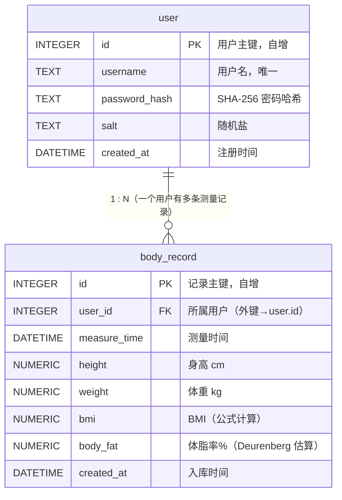

# BMI 体质评估与预测系统 · 数据库详细设计文档（DBDD）

| 项 | 内容 |
|----|------|
| 文档标题 | BMI 体质评估与预测系统 数据库详细设计文档 |
| 版本 | v1.0 |
| 日期 | 2026-07-14 |
| 上游文档 | `docs/plan.md` 第 4 节「数据库表结构」（`t_user` / `t_record` 建表 DDL、字段、约束、索引、外键设计） |
| 治理宪章 | `CODEBUDDY.md`（技术栈白名单、目录约定、命名规则、数据库选型约定、敏感配置处理） |
| 编写角色 | **DBA Agent（数据库管理员）** |
| 适用范围 | `spec.md` FR-01（用户登录注册）、FR-05（历史记录保存/查询/删除）；并支撑 FR-03（BMI）、FR-04（体脂）、FR-06（图表）数据落地 |

> 本设计严格遵循 `CODEBUDDY.md` 技术栈边界：仅使用 **Java 8+ JDBC + SQLite（首选）/ MySQL（兼容）**，不引入任何 ORM（MyBatis/Hibernate）或白名单外数据库技术。配置文件经 `JdbcUtil` 从 `db-config.properties` 读取，源码零硬编码。

---

## 1. 文档信息

本文档是 `plan.md` 第 4 节「数据库表结构」的细化与落地版本，作为开发阶段建表与 DAO 实现的唯一权威依据。

- **设计目标**：支撑账号体系（FR-01）与测量时序数据的持久化、按用户时间区间查询与删除（FR-05）。
- **技术约束**：数据库选型以 `plan.md` 第 7/8 节确认为准——**首选 SQLite**（文件型零配置、桌面端零服务）；同时给出 **MySQL** 方言版本以满足宪章「JDBC + MySQL 或 SQLite」弹性白名单，便于后续若迁移服务端数据库时平滑切换。
- **核心实体**：`user`（身份）、`body_record`（测量时序）。两表通过 `body_record.user_id → user.id` 建立一对多关联。

---

## 2. E-R 图说明（实体—关系）

### 2.1 关系图（Mermaid erDiagram）



### 2.2 关系图（ASCII，便于无渲染环境查看）

```text
   ┌──────────────┐         1     0..N        ┌──────────────────┐
   │    user      │ ─────────────────────────▶│   body_record    │
   │  (身份主表)  │   拥有 / 被引用           │  (测量时序表)    │
   └──────────────┘                           └──────────────────┘
         │  id (PK)                                   │ user_id (FK)
         │                                            │
         └─────────────── 外键关联 ───────────────────┘
              body_record.user_id  REFERENCES  user.id   (ON DELETE CASCADE)
```

### 2.3 实体、属性与基数说明

| 维度 | `user` | `body_record` |
|------|--------|---------------|
| 实体含义 | 用户身份主表（注册/登录） | 单次身体测量时序表（每次录入一条） |
| 主键 | `id`（`INTEGER` 自增） | `id`（`INTEGER` 自增） |
| 外键 | 无 | `user_id` → `user.id` |
| 基数 | 一方（1） | 多方（0..N） |
| 关联字段 | — | `body_record.user_id` 指向 `user.id` |
| 职责边界 | 仅存身份与认证要素（用户名、密码哈希、盐、注册时间） | 仅存每次测量的时序数值，不含身份敏感信息；通过 `user_id` 归属到具体用户 |

> **基数**：一个 `user` 可对应 0 到 N 条 `body_record`（新注册用户尚无记录时为 0 条）；一条 `body_record` 必然归属且仅归属一个 `user`（N:1）。删除用户时级联删除其全部测量记录（`ON DELETE CASCADE`）。

---

## 3. 表结构设计（逐表）

> 字段命名统一「小写下划线」风格（宪章第 4 节）。`bmi` 由 `CalcUtil.calcBmi` 计算（FR-03），`body_fat` 由 `CalcUtil.predictBodyFat`（Deurenberg 公式）估算（FR-04），二者均**不**在数据库内计算，仅持久化结果，符合「db 层不含业务计算」铁律。
>
> **BMI 分级**：`CalcUtil.classifyBmi` 返回 `BmiCategory` 枚举（`UNDERWEIGHT` / `NORMAL` / `OVERWEIGHT` / `OBESE`），位于 `com.bmi.model` 包。数据库不存储分级文本，仅持久化 `bmi` 数值；中文分级文案由 view 层 i18n 根据枚举值查表获取。`CalcUtil` 归属 `com.bmi.model.ai` 包，与 `BmiCategory` 跨包引用。

### 3.1 `user` 用户表

| 字段名 | 类型 | 主键 | 外键 | 非空 | 唯一 | 默认值 | 中文注释 | 约束说明 |
|--------|------|------|------|------|------|--------|----------|----------|
| `id` | INTEGER | ✅ | — | ✅ | — | 自增 | 用户唯一标识 | 主键，自增（MySQL `AUTO_INCREMENT` / SQLite `INTEGER PRIMARY KEY AUTOINCREMENT`） |
| `username` | TEXT / VARCHAR(64) | — | — | ✅ | ✅ | — | 用户名（登录账号） | 3–20 位，字母/数字/下划线；唯一且非空（FR-01 注册唯一性校验） |
| `password_hash` | TEXT / VARCHAR(64) | — | — | ✅ | — | — | 密码哈希值 | 仅存「随机盐 + SHA-256」不可逆散列，**绝不存明文**（spec 数据安全；AC-01） |
| `salt` | TEXT / VARCHAR(32) | — | — | ✅ | — | — | 随机盐值 | 注册时生成，与密码拼接后散列；用于抵御彩虹表（plan.md `UserDao.insert` 写 salt） |
| `created_at` | DATETIME | — | — | ✅ | — | CURRENT_TIMESTAMP | 账号注册时间 | 默认当前时间；用于审计与排序 |
| `updated_at` | DATETIME | — | — | — | — | CURRENT_TIMESTAMP | 资料最后更新时间 | 可选；登录态校验/资料变更时刷新（宪章允许补充字段，本设计增设以支持运维） |
| `status` | TINYINT / INTEGER | — | — | ✅ | — | 1 | 账号状态 | 1=正常，0=禁用；用于软封禁（默认正常）。删除采用级联物理删，故无需 `deleted_at` |

> 索引设计：`username` 建**唯一索引**（UNIQUE），支撑 FR-01 登录 `findByUsername` 与注册 `existsUsername` 的 O(1) 命中（呼应 plan.md 索引策略）。

### 3.2 `body_record` 测量记录表

| 字段名 | 类型 | 主键 | 外键 | 非空 | 唯一 | 默认值 | 中文注释 | 约束说明 |
|--------|------|------|------|------|------|--------|----------|----------|
| `id` | INTEGER | ✅ | — | ✅ | — | 自增 | 记录唯一标识 | 主键，自增 |
| `user_id` | INTEGER | — | ✅ | ✅ | — | — | 所属用户 ID | 外键 → `user.id`，`ON DELETE CASCADE`；记录隔离的关键（FR-05 防越权） |
| `measure_time` | DATETIME | — | — | ✅ | — | CURRENT_TIMESTAMP | 测量时间 | 默认当前时间；可录入历史时间（FR-02 可选 `measureTime`） |
| `height` | NUMERIC(5,2) | — | — | ✅ | — | — | 身高（cm） | CHECK `height BETWEEN 50 AND 250`（AC-02 区间） |
| `weight` | NUMERIC(5,2) | — | — | ✅ | — | — | 体重（kg） | CHECK `weight BETWEEN 10 AND 300`（AC-02 区间） |
| `bmi` | NUMERIC(4,1) | — | — | ✅ | — | — | BMI 值 | 由 `CalcUtil.calcBmi` 计算，保留 1 位小数（FR-03，公式 `weight/(h/100)²`）；CHECK `bmi > 0` |
| `body_fat` | NUMERIC(4,1) | — | — | ✅ | — | — | 体脂率（%） | 由 `CalcUtil.predictBodyFat`（Deurenberg 公式：1.2×BMI+0.23×age−10.8×gender−5.4）估算，保留 1 位小数（FR-04）；CHECK `body_fat BETWEEN 0 AND 100` |
| `created_at` | DATETIME | — | — | ✅ | — | CURRENT_TIMESTAMP | 入库时间 | 默认当前时间；与 `measure_time` 分离，记录落库时刻 |

> 索引设计：在 `(user_id, measure_time)` 上建**联合索引**，加速「按用户 + 时间区间」升序查询与趋势渲染（AC-05 查询 <1s），对应 `RecordDao.queryByUser(userId, start, end)`。

---

## 4. 建表 SQL（可直接执行）

> **表名说明**：本设计**正式表名**采用用户指定名 `user` 与 `body_record`。其中 `user` 是 **MySQL 保留字**，所有引用均须用反引号包裹（见第 6 节命名说明）。以下分别给出 **SQLite** 与 **MySQL** 两种方言，均可直接复制执行。

### 4.1 SQLite 方言（首选，plan.md 选型）

```sql
-- ============================================================
-- BMI 系统建表脚本 · SQLite 方言
-- 执行前确保数据库文件已建立；SQLite 外键需显式开启
-- ============================================================

-- 开启外键约束（SQLite 默认关闭，每次连接须执行）
PRAGMA foreign_keys = ON;

-- 用户表
CREATE TABLE IF NOT EXISTS "user" (
    id            INTEGER PRIMARY KEY AUTOINCREMENT,
    username      TEXT    NOT NULL UNIQUE,
    password_hash TEXT    NOT NULL,
    salt          TEXT    NOT NULL,
    created_at    DATETIME DEFAULT CURRENT_TIMESTAMP,
    updated_at    DATETIME DEFAULT CURRENT_TIMESTAMP,
    status        INTEGER  NOT NULL DEFAULT 1,
    CHECK (status IN (0, 1))
);

-- 测量记录表
CREATE TABLE IF NOT EXISTS body_record (
    id           INTEGER PRIMARY KEY AUTOINCREMENT,
    user_id      INTEGER NOT NULL,
    measure_time DATETIME NOT NULL DEFAULT CURRENT_TIMESTAMP,
    height       NUMERIC(5,2) NOT NULL,
    weight       NUMERIC(5,2) NOT NULL,
    bmi          NUMERIC(4,1) NOT NULL,
    body_fat     NUMERIC(4,1) NOT NULL,
    created_at   DATETIME NOT NULL DEFAULT CURRENT_TIMESTAMP,
    FOREIGN KEY (user_id) REFERENCES "user"(id) ON DELETE CASCADE,
    CHECK (height BETWEEN 50 AND 250),
    CHECK (weight BETWEEN 10 AND 300),
    CHECK (bmi > 0),
    CHECK (body_fat BETWEEN 0 AND 100)
);

-- 索引：用户名唯一索引（登录/注册查重）
CREATE UNIQUE INDEX IF NOT EXISTS idx_user_username ON "user"(username);

-- 索引：按用户+时间联合索引（历史查询/趋势加速）
CREATE INDEX IF NOT EXISTS idx_record_user_time ON body_record(user_id, measure_time);
```

**SQLite 方言注意点**：
- 自增使用 `INTEGER PRIMARY KEY AUTOINCREMENT`（`INTEGER PRIMARY KEY` 已隐含 rowid 自增，`AUTOINCREMENT` 保证单调递增不回收）。
- 外键**默认关闭**，必须 `PRAGMA foreign_keys = ON;` 且每次新连接都执行（写入 `JdbcUtil.getConnection()` 中）。
- 类型亲和：`INTEGER` / `TEXT` / `NUMERIC` / `DATETIME`（SQLite 无原生 DATETIME，按 TEXT/REAL 亲和存储，应用层用 `Timestamp` 转换）。
- SQLite 不支持 `COMMENT` 语法，字段中文注释见本文「第 5 节 字段注释汇总表」。
- `user` 在 SQLite 中**非保留字**，但建议保留反引号/双引号以保持与 MySQL 的可移植一致性。

### 4.2 MySQL 方言（兼容白名单，便于迁移服务端）

```sql
-- ============================================================
-- BMI 系统建表脚本 · MySQL 方言（InnoDB / utf8mb4）
-- 注意：user 为 MySQL 保留字，表名与字段引用一律反引号包裹
-- ============================================================

-- 用户表
CREATE TABLE IF NOT EXISTS `user` (
    `id`            INT UNSIGNED NOT NULL AUTO_INCREMENT,
    `username`      VARCHAR(64)  NOT NULL,
    `password_hash` VARCHAR(64)  NOT NULL,
    `salt`          VARCHAR(32)  NOT NULL,
    `created_at`    DATETIME     NOT NULL DEFAULT CURRENT_TIMESTAMP,
    `updated_at`    DATETIME     NOT NULL DEFAULT CURRENT_TIMESTAMP ON UPDATE CURRENT_TIMESTAMP,
    `status`        TINYINT      NOT NULL DEFAULT 1,
    PRIMARY KEY (`id`),
    UNIQUE KEY `uk_user_username` (`username`),
    CONSTRAINT `chk_user_status` CHECK (`status` IN (0, 1))
) ENGINE=InnoDB DEFAULT CHARSET=utf8mb4 COMMENT='用户身份主表（FR-01 登录注册）';

-- 测量记录表
CREATE TABLE IF NOT EXISTS `body_record` (
    `id`           INT UNSIGNED NOT NULL AUTO_INCREMENT,
    `user_id`      INT UNSIGNED NOT NULL,
    `measure_time` DATETIME     NOT NULL DEFAULT CURRENT_TIMESTAMP,
    `height`       DECIMAL(5,2) NOT NULL,
    `weight`       DECIMAL(5,2) NOT NULL,
    `bmi`          DECIMAL(4,1) NOT NULL,
    `body_fat`     DECIMAL(4,1) NOT NULL,
    `created_at`   DATETIME     NOT NULL DEFAULT CURRENT_TIMESTAMP,
    PRIMARY KEY (`id`),
    KEY `idx_record_user_time` (`user_id`, `measure_time`),
    CONSTRAINT `fk_record_user` FOREIGN KEY (`user_id`)
        REFERENCES `user` (`id`) ON DELETE CASCADE,
    CONSTRAINT `chk_record_height`  CHECK (`height`  BETWEEN 50  AND 250),
    CONSTRAINT `chk_record_weight`  CHECK (`weight`  BETWEEN 10  AND 300),
    CONSTRAINT `chk_record_bmi`     CHECK (`bmi` > 0),
    CONSTRAINT `chk_record_bodyfat` CHECK (`body_fat` BETWEEN 0 AND 100)
) ENGINE=InnoDB DEFAULT CHARSET=utf8mb4 COMMENT='单次身体测量时序表（FR-05 历史记录）';

-- 字段级 COMMENT（MySQL 支持行内 COMMENT）
ALTER TABLE `user`
    MODIFY COLUMN `username`      VARCHAR(64) NOT NULL COMMENT '用户名（登录账号，3-20位字母/数字/下划线）',
    MODIFY COLUMN `password_hash` VARCHAR(64) NOT NULL COMMENT 'SHA-256 密码哈希（随机盐拼接，绝不存明文）',
    MODIFY COLUMN `salt`          VARCHAR(32) NOT NULL COMMENT '随机盐值，注册时生成',
    MODIFY COLUMN `created_at`    DATETIME    NOT NULL DEFAULT CURRENT_TIMESTAMP COMMENT '账号注册时间',
    MODIFY COLUMN `updated_at`    DATETIME    NOT NULL DEFAULT CURRENT_TIMESTAMP ON UPDATE CURRENT_TIMESTAMP COMMENT '资料最后更新时间',
    MODIFY COLUMN `status`        TINYINT     NOT NULL DEFAULT 1 COMMENT '账号状态：1=正常，0=禁用';

ALTER TABLE `body_record`
    MODIFY COLUMN `user_id`      INT UNSIGNED NOT NULL COMMENT '所属用户ID（外键→user.id）',
    MODIFY COLUMN `measure_time` DATETIME     NOT NULL DEFAULT CURRENT_TIMESTAMP COMMENT '测量时间',
    MODIFY COLUMN `height`       DECIMAL(5,2) NOT NULL COMMENT '身高cm（区间50-250）',
    MODIFY COLUMN `weight`       DECIMAL(5,2) NOT NULL COMMENT '体重kg（区间10-300）',
    MODIFY COLUMN `bmi`          DECIMAL(4,1) NOT NULL COMMENT 'BMI值，由CalcUtil公式计算（FR-03）',
    MODIFY COLUMN `body_fat`     DECIMAL(4,1) NOT NULL COMMENT '体脂率%，由Deurenberg公式估算（FR-04）',
    MODIFY COLUMN `created_at`   DATETIME     NOT NULL DEFAULT CURRENT_TIMESTAMP COMMENT '入库时间';
```

**MySQL 方言注意点**：
- 自增使用 `AUTO_INCREMENT`；主键类型 `INT UNSIGNED`。
- 引擎**必须** `InnoDB`（仅 InnoDB 支持外键）；字符集 `utf8mb4`。
- `user` 为 MySQL **保留字**，所有建表与引用处均用反引号 `` `user` `` 包裹，否则报 `1064` 语法错误。
- MySQL 8.0+ 支持 `CHECK` 约束；5.7 及更早版本会解析但忽略 CHECK（建议 8.0+）。
- 外键开启为 InnoDB 默认行为，无需额外 PRAGMA；连接后 `SET FOREIGN_KEY_CHECKS=1;`（默认即开）。
- 字段注释用 `COMMENT '...'`（建表行内或 `ALTER ... MODIFY COLUMN ... COMMENT`）。

### 4.3 外键开启与索引补充语句（跨方言）

```sql
-- SQLite：每次新连接必须执行（建议写入 JdbcUtil.getConnection()）
PRAGMA foreign_keys = ON;

-- MySQL：默认开启，显式确认即可
-- SET FOREIGN_KEY_CHECKS = 1;

-- SQLite 下若需在 CREATE TABLE 外单独建索引（等价 4.1 已含）：
-- CREATE UNIQUE INDEX IF NOT EXISTS idx_user_username ON "user"(username);
-- CREATE INDEX IF NOT EXISTS idx_record_user_time ON body_record(user_id, measure_time);
```

### 4.4 连接超时配置

`JdbcUtil`（`com.bmi.model.db` 包）已在 `getConnection()` 中应用超时常量，防止数据库不可达时线程长时间阻塞：

| 常量 | 值 | 应用方式 | 生效范围 |
|------|----|----------|----------|
| `CONNECT_TIMEOUT_MS` | 5000（5 秒） | `DriverManager.setLoginTimeout(CONNECT_TIMEOUT_MS / 1000)` | MySQL + SQLite |
| `READ_TIMEOUT_MS` | 10000（10 秒） | `conn.setNetworkTimeout(executor, READ_TIMEOUT_MS)` | 仅 MySQL（SQLite 驱动不支持，已 try-catch 跳过） |

常量命名遵循 CODEBUDDY.md §4.2 全大写下划线规范。`setNetworkTimeout` 使用的 `Executor` 为静态 daemon 线程复用，避免每次连接创建线程池。

| 表名 | 字段名 | 类型（SQLite / MySQL） | 中文注释 | 来源需求(FR) |
|------|--------|------------------------|----------|--------------|
| `user` | `id` | INTEGER / INT UNSIGNED | 用户唯一标识（主键自增） | FR-01 |
| `user` | `username` | TEXT / VARCHAR(64) | 用户名（登录账号，3-20位字母/数字/下划线，唯一） | FR-01 |
| `user` | `password_hash` | TEXT / VARCHAR(64) | 密码 SHA-256 哈希（随机盐拼接，绝不存明文） | FR-01 / spec 数据安全 |
| `user` | `salt` | TEXT / VARCHAR(32) | 随机盐值（注册时生成，抵御彩虹表） | FR-01 |
| `user` | `created_at` | DATETIME | 账号注册时间 | FR-01 |
| `user` | `updated_at` | DATETIME | 资料最后更新时间 | FR-01（运维扩展） |
| `user` | `status` | INTEGER / TINYINT | 账号状态：1=正常，0=禁用 | FR-01（运维扩展） |
| `body_record` | `id` | INTEGER / INT UNSIGNED | 记录唯一标识（主键自增） | FR-05 |
| `body_record` | `user_id` | INTEGER / INT UNSIGNED | 所属用户 ID（外键→user.id，级联删） | FR-05（隔离/防越权） |
| `body_record` | `measure_time` | DATETIME | 测量时间（可录入历史时间） | FR-02 / FR-05 |
| `body_record` | `height` | NUMERIC(5,2) / DECIMAL(5,2) | 身高 cm（区间 50–250） | FR-02 / FR-05 |
| `body_record` | `weight` | NUMERIC(5,2) / DECIMAL(5,2) | 体重 kg（区间 10–300） | FR-02 / FR-05 |
| `body_record` | `bmi` | NUMERIC(4,1) / DECIMAL(4,1) | BMI 值（由 CalcUtil 公式计算，FR-03） | FR-03 / FR-05 |
| `body_record` | `body_fat` | NUMERIC(4,1) / DECIMAL(4,1) | 体脂率 %（Deurenberg 公式估算，FR-04） | FR-04 / FR-05 |
| `body_record` | `created_at` | DATETIME | 入库时间 | FR-05 |

---

## 6. 命名说明与宪章对齐

### 6.1 对宪章/plan.md 的遵循点 ✅

| 约定 | 遵循情况 |
|------|----------|
| 字段「小写下划线」 | ✅ 全部字段（`user_id`、`measure_time`、`password_hash` 等）均符合 |
| 外键关联 | ✅ `body_record.user_id` 关联 `user.id`，`ON DELETE CASCADE` |
| 索引策略 | ✅ `username` 唯一索引 + `(user_id, measure_time)` 联合索引，呼应 plan.md |
| 仅 JDBC（无 ORM） | ✅ 纯 DDL + DAO，未引入 MyBatis/Hibernate |
| 敏感配置外置 | ✅ DB 配置读 `db-config.properties`，密钥读 `ai-key.properties`（见 6.3） |

### 6.2 表名偏离宪章说明 ⚠️

- **宪章规定**：数据库表名应使用 `t_` 前缀（`t_user`、`t_record`，见 CODEBUDDY.md 第 4 节及 plan.md 第 5/7 节）。
- **本次偏离**：用户明确指定正式表名为 **`user`** 与 **`body_record`**。本设计以用户指定名作为正式表名产出 SQL（见第 4 节）。
- **`user` 是 MySQL 保留字的处理**：所有建表与引用 SQL 一律用反引号 `` `user` ``（MySQL）/ 双引号 `"user"`（SQLite）包裹，避免 `1064` 语法错误；SQLite 下虽非保留字，仍建议加引号以保持双方言可移植。
- **统一建议（二选一，提交前团队确认）**：
  1. **改回宪章约定**：将 `user` 改为 `t_user`、`body_record` 改为 `t_record`，与 plan.md 第 4 节 DDL 完全一致，零偏离；
  2. **统一采用无前缀命名**：将 charter/plan.md 的 `t_user`/`t_record` 反向统一为 `user`/`body_record`，并同步更新 plan.md 第 4/5/7/9 节与 spec.md 中的 `t_user`/`t_record` 引用，避免文档与实现不一致。
  > 当前 SQL 已兼容两种最终命名：`body_record` 与 `t_record` 仅表名不同；若选方案 1，仅需把 `body_record` 替换为 `t_record`、把 `` `user` `` 替换为 `` `t_user` `` 即可。

### 6.3 敏感字段与配置处理

- **`password`/密码**：数据库**仅存** `password_hash`（随机盐 + SHA-256 不可逆散列），**绝不保存明文**（spec 数据安全；AC-01）。校验在 `UserController.login` 中重新计算散列并比对，由 `UserDao.findByUsername` 取回盐与哈希。
- **密钥与 DB 配置**：JDBC URL、用户名、密码等仅从 `db-config.properties` 读取（`JdbcUtil.getConnection()`）；AI Key 仅从 `ai-key.properties` 读取。**源码零硬编码**，两文件已 `gitignore`（宪章第 4/7 节、spec 第 6 节）。
- **数据隔离**：所有记录查询/删除均限定 `user_id`，杜绝越权读/删他人数据（FR-05；AC-05）。

---

## 7. FR / AC 追溯表

| 需求 | 说明 | 对应表 / 字段 | 对应方法/类 |
|------|------|---------------|-------------|
| FR-01 登录注册 | 注册唯一性、密码散列落库、登录比对 | `user`（username 唯一索引、password_hash、salt） | `UserController.register/login`、`UserDao.insert/findByUsername/existsUsername` |
| FR-02 身高体重录入 | 身高体重区间校验后入库 | `body_record.height`(CHECK 50–250)、`weight`(CHECK 10–300) | `RecordInputPanel.onSave`、`RecordController.createRecord` |
| FR-03 BMI 计算分级 | BMI 持久化（公式计算在 model 层） | `body_record.bmi` | `CalcUtil.calcBmi`、`RecordController` |
| FR-04 体脂预测 | 体脂率持久化（Deurenberg 估算在 model 层） | `body_record.body_fat` | `CalcUtil.predictBodyFat`、`RecordController` |
| FR-05 历史记录 | 保存每次测量、按用户+时间查询、删除本人记录 | `body_record`（全字段、`user_id` 外键、`idx_record_user_time` 索引） | `RecordController.queryRecords/deleteRecord`、`RecordDao.queryByUser/deleteById` |
| FR-06 折线图 | 按时间取序列渲染 | 查询 `body_record`（measure_time + 指标） | `ChartController.getSeries`、`ChartPanel.repaint` |
| AC-05 查询 <1s | 联合索引加速千条级查询 | `idx_record_user_time(user_id, measure_time)` | `RecordDao.queryByUser` |

> 说明：FR-06/F-07 仅消费 `body_record` 数据，无新增表；FR-03/FR-04 的计算逻辑归属 model 业务类，数据库只持久化结果，符合宪章第 5 节分层铁律。

---

## 附录：一键执行检查清单

- [ ] SQLite：`PRAGMA foreign_keys = ON;` 已写入 `JdbcUtil.getConnection()`。
- [ ] 表名按团队决议固定为 `user`/`body_record` 或统一回 `t_user`/`t_record`（勿混用）。
- [ ] MySQL 部署时确认版本 ≥ 8.0（CHECK 约束生效）且存储引擎 InnoDB。
- [ ] `db-config.properties` / `ai-key.properties` 已加入 gitignore，未硬编码。
- [ ] DAO 层对 `user` 表的引用在 MySQL 下均带反引号。
- [ ] `JdbcUtil.getConnection()` 已应用 `CONNECT_TIMEOUT_MS`（setLoginTimeout）与 `READ_TIMEOUT_MS`（setNetworkTimeout）超时常量。
- [ ] `CalcUtil` 位于 `com.bmi.model.ai` 包，`BmiCategory` 枚举位于 `com.bmi.model` 包，跨包 import 已配置。
